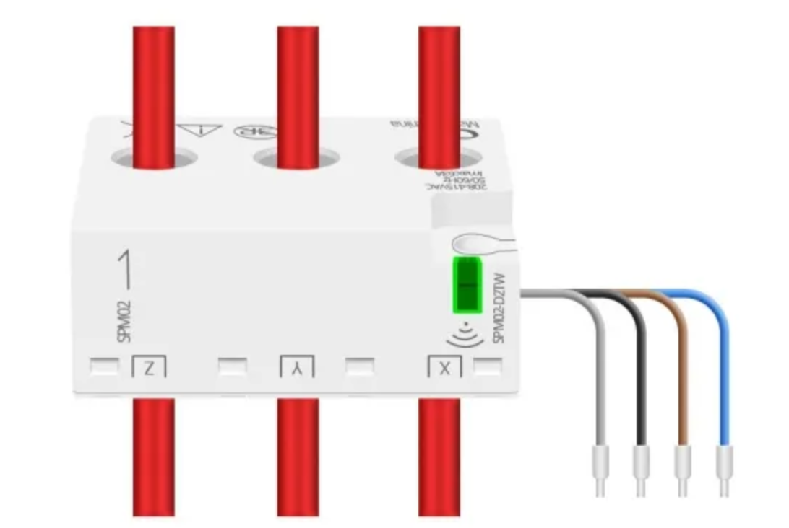
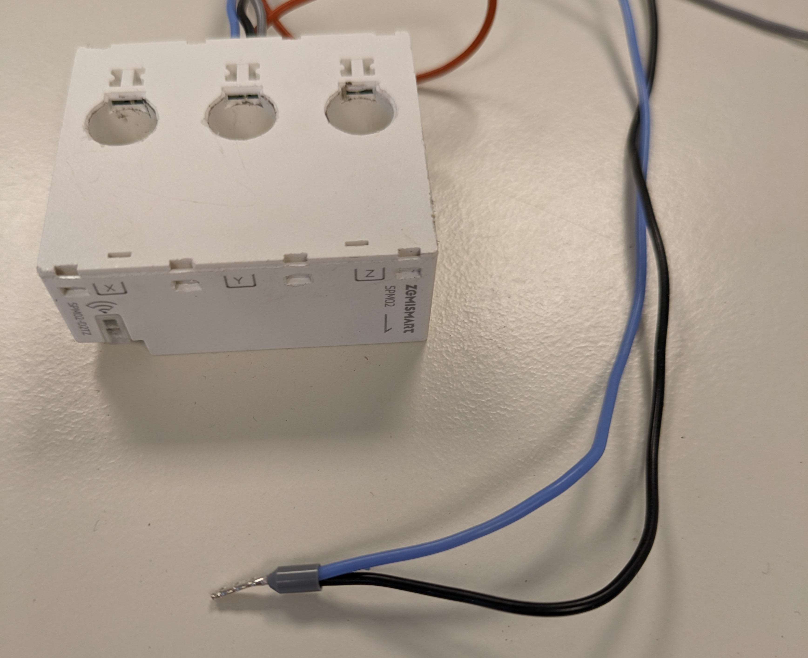
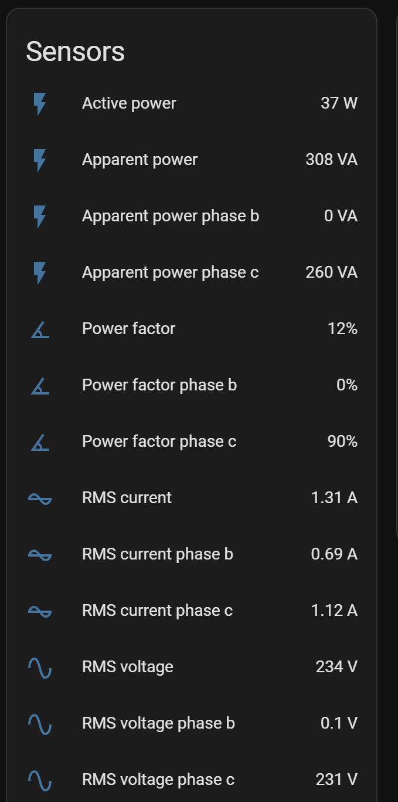
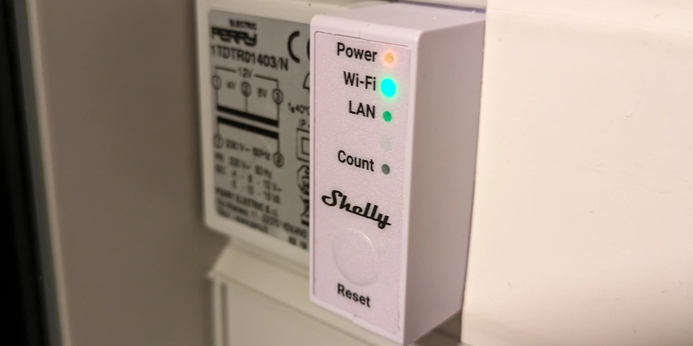

In the last months I tested some power measuring devices to measure the power consumption of my home and to get some insights on the amount of injection and consumption. This seemded like a challenge because of the type of gridconnection and the lack of a digital energy meter with P1 interface.

As home assistant enthousiast the main requirement was that the measurements should be available in home assistant and it should also be affordable.

## Types of grid connection
Depending on your location a residential home can have multiple types of connection. In my case 3 types are possible. 

- Single-phase **1x230V** (2 wires): The simplest connection you can have. There are many cheap meters available. 
- Three-phase **3N400V** (4 wires): 3 phase power meter needed.
- Three-phase **3x230V** (3 wires delta and rare): 3 phase power meter needed but rarelly officially supported by the meter. (definitly by the cheaper ones)

If you try to find options for the first 2 you will find multiple options easily. If you have a 3x230V connection like I do, Things get more difficult. 

## 3x230V delta connection
When you have a 3 wire three-phase connection you do not have a Neutral connection where power can flow back to the grid. Compared to a connection with neutral wire you also have only one voltage level available instead of 2. 

Most three-phase meters are designed for a 4 wire connection. Using the [3 wattmeter method](https://www.elprocus.com/what-is-three-wattmeter-method-and-its-working/). You can however also wire them for 3 wire [Which is then using the 2 wattmeter method](https://www.elprocus.com/two-wattmeter-method-in-process/). As for the settings of the device no changes are needed.

### Wiring
When wiring this up the big difference here is that you also connect the "N" connection to one of the 3 phase wires. This can be any phase exept for the one that is being used as power source of the power meter. If it's not clear which phase this is you can just try one. If the meter is not powering up you will need to change to another phase.

This is in most cases not explained in the manual. But just works because all meters build on top of the same priciples.

### Downsides
Wiring a meter like this has some downsides: 
- For one phase you are missing all measurements except the current measurement.
- The power consumption of a single phase does not produce a meaningful number. Only the summation of all phases is usable.

## SPM02

The first option I have tested is the zigbee SPM02 meter. This meter is also available in wifi variant, has a small from factor that fits above or below the circuit breaker. Zigbee2Mqtt has native support for this meter. The ZHA support is still in [progress](https://github.com/zigpy/zha-device-handlers/pull/2603) a.t.m. You can make it work with code changes but it is a hassle.

When wiring this meter you need to disconnect the wires from the breaker and wire them through the meter. 

For the delta wiring I have connected the N and the Y wire together.

{: w="250" h="400" .right}

In home assistant(using zha) we get measurements that look like this:

Here you can also see the values of phase b being 0 except for the current. The active power value is absolute, so it is not possible to know if you inject or consume power. 

The energy and produced energy do produce usable kWh measurements, That are usable in the Home assistant energy dashboard.

## Shelly Pro 3EM

I used the SPM02 for a few months and it did a good job, But I was looking for a meter with modbus support so I changed it to the Shelly PRO 3EM.

So here I also just wired phase B to the N connection. The wiring diagram shows phase C is used for the power to the device.